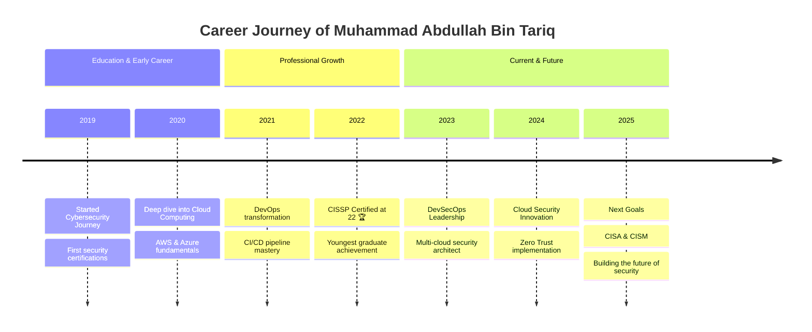

<!-- Animated Header Banner -->
<p align="center">
  
</p>

<h1 align="center">
  
</h1>

<h2 align="center" style="color:darkemerald;">
  
  Assalamu Alaikum, I'm Muhammad Abdullah Bin Tariq
  
</h2>

<h3 align="center" style="color:darkemerald;">
  🔐 DevSecOps Engineer | ☁️ Cloud Computing | 🛡️ CyberSecurity Enthusiast | 🌍 Open Source Advocate
</h3>

<p align="center">
  
  
  
</p>

<!-- Quick Stats Bar -->
<p align="center">
  
  
  
  
  
</p>

<p align="center">
  <a href="https://github.com/ryo-ma/github-profile-trophy">
    
  </a>
</p>

---

<!-- Contribution Snake Animation -->
<p align="center">
  <picture>
    <source media="(prefers-color-scheme: dark)" srcset="https://raw.githubusercontent.com/matx104/matx104/output/github-contribution-grid-snake-dark.svg">
    <source media="(prefers-color-scheme: light)" srcset="https://raw.githubusercontent.com/matx104/matx104/output/github-contribution-grid-snake.svg">
    
  </picture>
</p>

---

## ⚡ Quick Highlights

<div align="center">

| 🏆 Achievement | 📊 Stats | 🎯 Focus |
|:---:|:---:|:---:|
| Youngest CISSP @ 22 | 5+ Years Experience | Cloud Security |
| ISACA Member | Multi-Cloud Expert | DevSecOps |
| Open Source Contributor | Security Automation | Zero Trust |

</div>

---

## 📑 Table of Contents

- [⚡ Quick Highlights](#-quick-highlights)
- [🌐 Connect with Me](#-connect-with-me)
- [🌟 About Me](#-about-me)
- [🎯 My Journey](#-my-journey)
- [🏆 Certifications & Achievements](#-certifications--achievements)
- [🛠️ Technical Arsenal](#️-technical-arsenal)
- [📈 Weekly Development Breakdown](#-weekly-development-breakdown)
- [💼 Professional Focus](#-professional-focus)
- [🚀 Featured Projects](#-featured-projects)
- [📊 GitHub Analytics](#-github-analytics)
- [🎵 Vibing To](#-vibing-to)
- [📝 Latest Blog Posts](#-latest-blog-posts)
- [💡 Fun Facts About Me](#-fun-facts-about-me)
- [📚 Inspirational Wisdom](#-inspirational-wisdom)
- [🎮 Beyond The Terminal](#-beyond-the-terminal)
- [🌍 Languages](#-languages)
- [📚 Islamic Ethos](#-islamic-ethos)
- [☕ Support My Work](#-support-my-work)

---

## 🌐 Connect with Me

<p align="center">
  <a href="https://twitter.com/matx104" target="_blank">
    
  </a>
  <a href="https://linkedin.com/in/matx104" target="_blank">
    
  </a>
  <a href="https://medium.com/@matx104" target="_blank">
    
  </a>
  <a href="https://instagram.com/matx104" target="_blank">
    
  </a>
  <a href="https://fb.com/matx104" target="_blank">
    
  </a>
  <a href="https://wa.me/message/6XVASFBNIM54H1" target="_blank">
    
  </a>
  <a href="https://www.hackerrank.com/matx104" target="_blank">
    
  </a>
  <a href="https://linktr.ee/matx104" target="_blank">
    
  </a>
</p>

<p align="center">
  <a href="mailto:your.email@example.com">
    
  </a>
  <a href="https://github.com/matx104" target="_blank">
    
  </a>
  <a href="https://www.youtube.com/@matx104" target="_blank">
    
  </a>
  <a href="https://discord.gg/matx104" target="_blank">
    
  </a>
  <a href="https://dev.to/matx104" target="_blank">
    
  </a>
  <a href="https://hashnode.com/@matx104" target="_blank">
    
  </a>
</p>

---

## 🌟 About Me


```yaml
name: Muhammad Abdullah Bin Tariq
role: DevSecOps Engineer
location: Pakistan 🇵🇰
education: Cybersecurity & Cloud Computing
ethos: "Get better every day, conquer yourself, then the World 💪"
motto: "الله ورسوله أولاً، ثم عائلتي"

current_mission: |
  Building secure, scalable cloud infrastructure
  while advancing DevSecOps best practices
  
approach: |
  Security-first mindset in everything I build
  Automation over manual intervention
  Continuous learning and improvement
  
fun_facts:
  - 🎯 I automate everything I can
  - 🧩 Puzzle solver at heart
  - ☕ Coffee-powered engineer
  - 🌙 Night owl coder
```

### 🎯 Current Focus

- 🔐 **Mastering**: Terraform for Infrastructure as Code, Ansible for Configuration Management
- ☸️ **Deepening**: Kubernetes Security, Service Mesh (Istio/Linkerd), and Cloud-Native Security
- ☁️ **Architecting**: Multi-cloud strategies across AWS, GCP, and Azure
- 🛡️ **Specializing**: Red Team, Blue Team, and Purple Team operations
- 📝 **Sharing**: Writing technical articles on [Medium](https://matx104.medium.com) about DevSecOps and Cloud Security
- 🌱 **Learning**: Advanced threat modeling, zero-trust architecture, and SBOM (Software Bill of Materials)

### 💬 Ask Me About

- ☁️ Cloud Security Architecture (AWS/GCP/Azure)
- 🔐 DevSecOps Pipeline Implementation
- ☸️ Kubernetes Security & Hardening
- 🛡️ Penetration Testing & Vulnerability Assessment
- 🔴 Red Team, 🔵 Blue Team, 🟣 Purple Team Strategies
- 🐳 Container Security & Supply Chain Security
- 📊 Security Monitoring & Incident Response
- 🔧 Infrastructure as Code (Terraform/Ansible)

---

## 🎯 My Journey

<div align="center">



</div>

### 📊 Career Milestones

<table>
<tr>
<td width="33%" align="center">

**🎓 Education**

```
┌─────────────────────┐
│  Cybersecurity &    │
│  Cloud Computing    │
│    Graduate 🎓      │
└─────────────────────┘
```

</td>
<td width="33%" align="center">

**🏆 Certifications**

```
┌─────────────────────┐
│  CISSP Certified    │
│  at Age 22 🥇       │
│  Youngest Graduate  │
└─────────────────────┘
```

</td>
<td width="33%" align="center">

**🚀 Current Role**

```
┌─────────────────────┐
│ DevSecOps Engineer  │
│ Cloud Security      │
│ Architect 🔐        │
└─────────────────────┘
```

</td>
</tr>
</table>

---

## 🏆 Certifications & Achievements

<!-- Animated Certification Banner -->
<p align="center">
  
</p>

### 🎖️ Current Certifications

<p align="center">
  
  
  
</p>

### 🎯 Certification Roadmap & Goals

<p align="center">
  
  
  
  
</p>

### 📜 Complete Certification Journey

<div align="center">

<details open>
<summary><b>🔐 (ISC)² Certifications</b></summary>

| Status | Certification | Description | Target |
|:---:|:---|:---|:---:|
| ✅ | **CISSP** | Certified Information Systems Security Professional | 2022 ✓ |
| ✅ | **CC** | Certified in Cybersecurity | 2022 ✓ |
| 🎯 | **CCSP** | Certified Cloud Security Professional | 2025 |
| 🎯 | **ISSMP** | Information Systems Security Management Professional | 2025 |
| 🎯 | **ISSEP** | Information Systems Security Engineering Professional | 2026 |
| 🎯 | **ISSAP** | Information Systems Security Architecture Professional | 2026 |
| 🎯 | **CGRC** | Certified in Governance, Risk and Compliance | 2025 |

</details>

<details>
<summary><b>📊 ISACA Certifications (GRC Focus)</b></summary>

| Status | Certification | Description | Target |
|:---:|:---|:---|:---:|
| 🎯 | **CISA** | Certified Information Systems Auditor | 2025 |
| 🎯 | **CISM** | Certified Information Security Manager | 2025 |
| 🎯 | **CRISC** | Certified in Risk and Information Systems Control | 2025 |
| 🎯 | **CGEIT** | Certified in Governance of Enterprise IT | 2026 |
| 🎯 | **CDPSE** | Certified Data Privacy Solutions Engineer | 2026 |

</details>

<details>
<summary><b>🔴 Offensive Security Certifications</b></summary>

| Status | Certification | Description | Target |
|:---:|:---|:---|:---:|
| 🎯 | **CEH** | Certified Ethical Hacker (EC-Council) | 2025 |
| 🎯 | **OSCP** | Offensive Security Certified Professional | 2025 |
| 🎯 | **OSWE** | Offensive Security Web Expert | 2026 |
| 🎯 | **OSCE³** | Offensive Security Certified Expert | 2026 |
| 🎯 | **GPEN** | GIAC Penetration Tester | 2026 |
| 🎯 | **GWAPT** | GIAC Web Application Penetration Tester | 2026 |

</details>

<details>
<summary><b>🌐 Cisco Networking Certifications</b></summary>

| Status | Certification | Description | Target |
|:---:|:---|:---|:---:|
| 🎯 | **CCNA** | Cisco Certified Network Associate | 2025 |
| 🎯 | **CCNP Security** | Cisco Certified Network Professional Security | 2026 |
| 🎯 | **CCIE Security** | Cisco Certified Internetwork Expert Security | 2027 |

</details>

<details>
<summary><b>☁️ Cloud Security Certifications</b></summary>

| Status | Certification | Description | Target |
|:---:|:---|:---|:---:|
| 🎯 | **AWS Security Specialty** | AWS Certified Security - Specialty | 2025 |
| 🎯 | **Azure Security Engineer** | Microsoft Certified: Azure Security Engineer | 2025 |
| 🎯 | **GCP Security Engineer** | Google Professional Cloud Security Engineer | 2025 |
| 🎯 | **CKS** | Certified Kubernetes Security Specialist | 2025 |

</details>

</div>

### 🏛️ GRC (Governance, Risk & Compliance) Expertise

<p align="center">
  
</p>

<table>
<tr>
<td width="33%" align="center">

**🏛️ Governance**
```
├── Security Policies
├── Standards & Procedures
├── Security Architecture
├── Board Reporting
└── Strategic Planning
```

</td>
<td width="33%" align="center">

**⚠️ Risk Management**
```
├── Risk Assessment
├── Threat Modeling
├── Business Impact Analysis
├── Risk Treatment
└── Risk Monitoring
```

</td>
<td width="33%" align="center">

**📋 Compliance**
```
├── ISO 27001/27002
├── NIST CSF/800-53
├── SOC 2 Type II
├── PCI-DSS
└── GDPR/HIPAA
```

</td>
</tr>
</table>

### 🌟 Notable Achievements

- 🏅 **Youngest CISSP Graduate at Age 22** - Aiming to be the youngest CISA and CISM certified professional
- 🔐 **DevSecOps Expertise** - Successfully implemented security automation across CI/CD pipelines
- ☁️ **Multi-Cloud Architecture** - Designed and deployed secure infrastructure across AWS, Azure, and GCP
- 📝 **Technical Writer** - Regular contributor to cybersecurity and DevOps communities on Medium
- 🌍 **Open Source Advocate** - Active contributor to security and DevOps open-source projects

---

[](https://roadmap.sh)

---

## 🛠️ Technical Arsenal

<details open>
<summary><b>🚀 Click to Expand/Collapse Technical Skills</b></summary>

### ☁️ Cloud & Infrastructure

<p align="center">
  
  
  
  
  
  
  
</p>

### 🐳 Containers & Orchestration

<p align="center">
  
  
  
  
  
  
</p>

### 🔄 CI/CD & DevOps

<p align="center">
  
  
  
  
  
  
  
</p>

### 🔐 Security & Compliance

<p align="center">
  
  
  
  
  
  
  
  
  
  
</p>

### 🏛️ GRC & Compliance Frameworks

<p align="center">
  
  
  
  
  
  
  
  
  
  
  
  
</p>

### 🔴 Red Team & Penetration Testing

<p align="center">
  
  
  
  
  
  
  
  
  
  
</p>

### 🔵 Blue Team & Defensive Security

<p align="center">
  
  
  
  
  
  
  
  
  
  
</p>

### 📊 Monitoring & Observability

<p align="center">
  
  
  
  
  
  
  
  
  
  
  
  
</p>

### 💻 Programming & Scripting

<p align="center">
  
  
  
  
  
  
  
</p>

### 🗄️ Databases & Storage

<p align="center">
  
  
  
  
  
  
  
  
  
</p>

### 🌐 Networking & Infrastructure

<p align="center">
  
  
  
  
  
  
  
  
</p>

### 🐧 Operating Systems & Platforms

<p align="center">
  
  
  
  
  
  
  
</p>

### 🔧 Development Tools & IDEs

<p align="center">
  
  
  
  
  
  
  
</p>

### 🎨 Design & Creative Tools

<p align="center">
  
  
  
  
  
  
</p>

### 🧪 Testing & Automation

<p align="center">
  
  
  
  
</p>

### 🤖 Machine Learning & Data Science

<p align="center">
  
  
  
  
  
</p>

### 🎮 Game Development & 3D

<p align="center">
  
  
  
</p>

</details>

---

## 📈 Weekly Development Breakdown

<div align="center">

<!--START_SECTION:waka-->
```text
DevSecOps      ██████████████░░░░░░░░░   35.2%
Cloud Security █████████████░░░░░░░░░░░   30.8%
IaC/Terraform  ████████░░░░░░░░░░░░░░░░   15.5%
Kubernetes     █████░░░░░░░░░░░░░░░░░░░   10.2%
Documentation  ██░░░░░░░░░░░░░░░░░░░░░░    5.3%
Other          █░░░░░░░░░░░░░░░░░░░░░░░    3.0%
```
<!--END_SECTION:waka-->

</div>

### ⏰ This Week I Spent My Time On

<div align="center">

```text
💼 Work Focus:
├── 🔐 Security Automation        - 12+ hrs
├── ☁️ Cloud Infrastructure       - 10+ hrs
├── 🐳 Container Security         - 8+ hrs
├── 📊 Monitoring & Observability - 6+ hrs
└── 📝 Documentation & Blogs      - 4+ hrs

🛠️ Technologies Used:
├── Terraform & Ansible           ████████████░░░░   40%
├── Kubernetes & Docker           ██████████░░░░░░   35%
├── Python & Bash                 ████████░░░░░░░░   20%
└── Go & JavaScript               ██░░░░░░░░░░░░░░    5%
```

</div>

---

## 💼 Professional Focus

<table>
<tr>
<td width="50%">

### 🎯 Current Projects
- 🔐 Building Zero-Trust Security Architecture
- ☸️ Implementing Service Mesh with Istio
- 🚀 Automating Cloud Infrastructure with Terraform
- 📊 Developing Comprehensive Security Monitoring
- 🔧 Creating Custom DevSecOps Pipeline Templates

</td>
<td width="50%">

### 🌱 Learning & Growth
- 📖 Advanced Kubernetes CKS (Certified Kubernetes Security Specialist)
- 🎓 Cloud Security Posture Management (CSPM)
- 🔍 Threat Intelligence & Hunting
- 🛡️ Security Automation & SOAR
- 🌐 Multi-Cloud Governance & Compliance

</td>
</tr>
</table>

---

## 🚀 Featured Projects

<div align="center">

### 🔐 Security & DevSecOps Projects

| Project | Description | Tech Stack |
|---------|-------------|------------|
| 🛡️ **Cloud Security Automation** | Automated security scanning and remediation for multi-cloud environments | Python, Terraform, AWS, Azure |
| 🐳 **Container Security Pipeline** | Complete DevSecOps pipeline with container scanning and policy enforcement | Docker, Kubernetes, Trivy, OPA |
| 📊 **Security Monitoring Platform** | Centralized security monitoring and incident response system | Prometheus, Grafana, ELK, Wazuh |
| 🔧 **IaC Security Templates** | Secure Infrastructure as Code templates with built-in compliance | Terraform, CloudFormation, Ansible |
| 🚨 **Automated Threat Detection** | ML-based threat detection and response automation | Python, TensorFlow, SIEM Integration |

</div>

<p align="center">
  <a href="https://github.com/matx104?tab=repositories">
    
  </a>
</p>

---

## 📊 GitHub Analytics

<p align="center">
  
  
</p>

<p align="center">
  
</p>

<p align="center">
  
</p>

<details>
<summary><b>📈 More GitHub Metrics</b></summary>

<p align="center">
  
</p>

<p align="center">
  
  
</p>

</details>

---

## 🎵 Vibing To

<div align="center">

<a href="https://open.spotify.com/user/matx104">
  
</a>

<br/>

<p>
  
  
</p>

**🎧 Music genres I code to:**

`Lo-Fi` `Nasheed` `Classical` `Ambient` `Electronic` `OST` `Soundtrack`

</div>

---

## 📝 Latest Blog Posts

<!-- BLOG-POST-LIST:START -->
<div align="center">

### 📚 Recent Articles on [Medium](https://matx104.medium.com)

| Title | Topic | Date |
|-------|-------|------|
| 🔐 **DevSecOps Best Practices in 2024** | Security, DevOps | Latest |
| ☁️ **Multi-Cloud Security Architecture** | Cloud, Security | Recent |
| 🐳 **Container Security Deep Dive** | Kubernetes, Security | Recent |
| 🛡️ **Zero-Trust Implementation Guide** | Security, Architecture | Recent |

<a href="https://matx104.medium.com">
  
</a>

</div>
<!-- BLOG-POST-LIST:END -->

---

## 💡 Fun Facts About Me

<div align="center">

<table>
<tr>
<td align="center" width="25%">

🌙

**Night Owl**

I do my best coding between 10 PM - 4 AM

</td>
<td align="center" width="25%">

☕

**Coffee Addict**

Approximately 4-6 cups per day while coding

</td>
<td align="center" width="25%">

🎯

**Automation Freak**

If I do it twice, I automate it!

</td>
<td align="center" width="25%">

🧩

**Puzzle Solver**

I see security as an endless puzzle

</td>
</tr>
<tr>
<td align="center" width="25%">

📚

**Constant Learner**

Always reading or taking courses

</td>
<td align="center" width="25%">

🏃

**Multi-Sport Athlete**

9 sports and counting!

</td>
<td align="center" width="25%">

🌍

**Polyglot**

Speaking 7 languages

</td>
<td align="center" width="25%">

🎮

**Fighting Game Fan**

Leroy Smith main in Tekken

</td>
</tr>
</table>

</div>

### 🔥 Random Facts

<div align="center">

```python
class MatX104:
    def __init__(self):
        self.name = "Muhammad Abdullah Bin Tariq"
        self.alias = "Monarch+_+MAT"
        self.role = "DevSecOps Engineer"
        self.code = ["Python", "Bash", "Go", "JavaScript", "TypeScript"]
        self.tools = ["Terraform", "Ansible", "Kubernetes", "Docker"]
        self.cloud = ["AWS", "Azure", "GCP"]
        self.current_focus = "Building Zero Trust Architecture"
        
    def say_bismillah(self):
        return "بِسْمِ اللهِ الرَّحْمٰنِ الرَّحِيْم"
    
    def daily_routine(self):
        return {
            "morning": "☀️ Fajr Prayer → Coffee → News",
            "day": "💻 Code → Security Reviews → Meetings",
            "evening": "🏃 Exercise → Family Time → Reading",
            "night": "🌙 Deep Work → Learning → Sleep"
        }
    
    def life_goals(self):
        return [
            "🎯 Become youngest CISA & CISM",
            "📚 Write a cybersecurity book",
            "🌍 Build a security community",
            "💼 Start a security consultancy"
        ]
        
me = MatX104()
```

</div>

---

## 📚 Inspirational Wisdom

<!-- Animated Wisdom Banner -->
<p align="center">
  
</p>

<table>
<tr>
<td width="50%">

### ⚔️ Anime & Manga Wisdom

> *"A lesson without pain is meaningless. That's because you can't gain something without sacrificing something in return."*
> 
> — **Edward Elric, Fullmetal Alchemist**

> *"The world isn't perfect. But it's there for us, doing the best it can... that's what makes it so damn beautiful."*
> 
> — **Roy Mustang, Fullmetal Alchemist**

> *"Hard work is worthless for those that don't believe in themselves."*
> 
> — **Naruto Uzumaki**

> *"If you don't take risks, you can't create a future."*
> 
> — **Monkey D. Luffy, One Piece**

> *"Power comes in response to a need, not a desire. You have to create that need."*
> 
> — **Goku, Dragon Ball Z**

> *"The moment you give up is the moment you let someone else win."*
> 
> — **Koro-sensei, Assassination Classroom**

> *"If you want to be strong, learn to fight alone."*
> 
> — **Vegeta, Dragon Ball Z**

> *"Knowing sorrow is not terrifying. What is terrifying is knowing you can't go back to happiness you could have."*
> 
> — **Gaara, Naruto**

</td>
<td width="50%">

### 🎬 From Fiction & Games

> *"When the snows fall and the white winds blow, the lone wolf dies, but the pack survives."*
> 
> — **Game of Thrones**

> *"Even in the darkest times, hope cuts through. Hope is the light that lifts us out of darkness."*
> 
> — **Lorien Legacies**

> *"It's not the face that makes someone a monster; it's the choices they make with their lives."*
> 
> — **Harry Potter**

> *"Fate rarely calls upon us at a moment of our choosing."*
> 
> — **Optimus Prime, Transformers**

> *"A man who has not prepared his children for his own death has failed as a father."*
> 
> — **Kratos, God of War**

> *"We don't get to choose how we start in this life. Real greatness is what you do with the hand you're dealt."*
> 
> — **Victor Sullivan, Uncharted**

</td>
</tr>
<tr>
<td width="50%">

### 🥋 Warrior Philosophy

> *"Perceive that which cannot be seen with the eye."*
> 
> — **Miyamoto Musashi, The Book of Five Rings**

> *"The ultimate aim of martial arts is not having to use them."*
> 
> — **Miyamoto Musashi**

> *"Think lightly of yourself and deeply of the world."*
> 
> — **Miyamoto Musashi**

> *"Do not seek to follow in the footsteps of the wise. Seek what they sought."*
> 
> — **Matsuo Bashō**

> *"Fall seven times, stand up eight."*
> 
> — **Japanese Proverb**

</td>
<td width="50%">

### 💡 Personal Philosophy

> *"Get better every day, conquer yourself, then the World."*
> 
> — **Monarch+_+MAT**

> *"Security is not a product, but a process."*
> 
> — **Bruce Schneier**

> *"The best time to plant a tree was 20 years ago. The second best time is now."*
> 
> — **Chinese Proverb**

> *"Everyone has a plan until they get punched in the mouth."*
> 
> — **Mike Tyson**

> *"Code without tests is broken by design."*
> 
> — **DevOps Wisdom**

</td>
</tr>
</table>

---

## 📖 Books That Shape My Mentality

<!-- Animated Books Banner -->
<p align="center">
  
</p>

<div align="center">

### 🕌 The Foundation - Islamic Texts

<table>
<tr>
<td align="center" width="50%">

**📖 The Holy Quran**


*The ultimate source of guidance, wisdom, and truth. The foundation of my life, decisions, and character.*

> *"وَقُل رَّبِّ زِدْنِي عِلْمًا"*
> 
> *"And say: My Lord, increase me in knowledge"* - Surah Ta-Ha: 114

</td>
<td align="center" width="50%">

**📚 Hadith Collections**


*The teachings and practices of Prophet Muhammad ﷺ that guide my daily conduct and professional ethics.*

> *"خَيْرُكُمْ مَنْ تَعَلَّمَ الْقُرْآنَ وَعَلَّمَهُ"*
> 
> *"The best among you are those who learn the Quran and teach it"*

</td>
</tr>
</table>

</div>

### ⚔️ Strategy & Power

<table>
<tr>
<td width="33%" align="center">

**🗡️ The Book of Five Rings**
*Miyamoto Musashi*


The way of strategy, the art of combat, and the philosophy of the warrior. Musashi's timeless wisdom on mastery, discipline, and the pursuit of excellence.

*"You must understand that there is more than one path to the top of the mountain."*

</td>
<td width="33%" align="center">

**👑 The 48 Laws of Power**
*Robert Greene*


Understanding the dynamics of power, influence, and human nature. Essential reading for navigating complex professional environments.

*"Never outshine the master... but always be ready to take their place."*

</td>
<td width="33%" align="center">

**🦁 The Prince**
*Niccolò Machiavelli*


The foundational text on political strategy and leadership. Understanding power dynamics and the art of governance.

*"It is better to be feared than loved, if you cannot be both."*

</td>
</tr>
</table>

### 📚 Robert Greene Collection

<table>
<tr>
<td width="25%" align="center">

**🎭 The Art of Seduction**

Understanding influence and persuasion dynamics

</td>
<td width="25%" align="center">

**⚔️ The 33 Strategies of War**

Strategic thinking for business and life challenges

</td>
<td width="25%" align="center">

**🎯 Mastery**

The path to becoming world-class at any skill

</td>
<td width="25%" align="center">

**🌊 The Laws of Human Nature**

Deep understanding of human psychology

</td>
</tr>
</table>

### 📖 Leadership & Philosophy

<table>
<tr>
<td width="25%" align="center">

**🏛️ Meditations**
*Marcus Aurelius*

Stoic philosophy and self-discipline from a Roman Emperor

</td>
<td width="25%" align="center">

**☯️ The Art of War**
*Sun Tzu*

Ancient Chinese military strategy applicable to business and security

</td>
<td width="25%" align="center">

**🧠 Thinking, Fast and Slow**
*Daniel Kahneman*

Understanding cognitive biases and decision-making

</td>
<td width="25%" align="center">

**🔥 Extreme Ownership**
*Jocko Willink*

Leadership lessons from Navy SEALs

</td>
</tr>
</table>

### 🔐 Cybersecurity & Technical Reading

<table>
<tr>
<td width="25%" align="center">

**🔒 The Web Application Hacker's Handbook**

Essential for web security

</td>
<td width="25%" align="center">

**🛡️ The Art of Intrusion**
*Kevin Mitnick*

Real-world hacking stories

</td>
<td width="25%" align="center">

**☁️ Cloud Security Handbook**

Cloud architecture security

</td>
<td width="25%" align="center">

**🔴 Red Team Field Manual**

Penetration testing reference

</td>
</tr>
</table>

<div align="center">

### 📊 Reading Stats

<table>
<tr>
<td align="center" width="25%">

**50+**

Books Read

</td>
<td align="center" width="25%">

**📚**

Currently Reading: 3

</td>
<td align="center" width="25%">

**🎯**

2025 Goal: 24 Books

</td>
<td align="center" width="25%">

**⭐**

Favorites: Strategy

</td>
</tr>
</table>

</div>

---

## 🔧 Complete Toolset Reference

<details>
<summary><b>🛠️ Monitoring & Logging Arsenal (Click to expand)</b></summary>

### 📊 Monitoring Solutions
- **Grafana** - Visualization and analytics
- **Prometheus** - Metrics and alerting
- **Zabbix** - Enterprise monitoring
- **Nagios Core** - Infrastructure monitoring
- **Thanos** - Prometheus long-term storage
- **Jaeger** - Distributed tracing
- **Loki** - Log aggregation
- **Alertmanager** - Alert handling
- **VictoriaMetrics** - Time series database
- **Weave Scope** - Container monitoring
- **Netdata** - Real-time performance monitoring
- **Node Exporter** - Hardware and OS metrics
- **cAdvisor** - Container metrics
- **Kube-Prometheus** - Kubernetes monitoring stack

### 📝 Logging Solutions
- **Kibana** - Log visualization
- **Fluentd** - Log collection
- **Fluent Bit** - Lightweight log processor
- **Splunk** - Enterprise log management
- **LogicMonitor** - Infrastructure monitoring
- **Site24x7** - Application performance monitoring

### 📈 APM & Observability
- **New Relic** - Application performance monitoring
- **Sysdig** - Container intelligence
- **OpenTelemetry** - Observability framework
- **Sentry** - Error tracking

</details>

<details>
<summary><b>🔒 Network Security & Penetration Testing Tools (Click to expand)</b></summary>

### 🛡️ Firewalls & Network Security
- **pfSense** - Open source firewall
- **OPNsense** - Firewall and routing platform
- **Cisco ASA** - Enterprise firewall
- **PacketFence** - Network access control

### 🔍 Vulnerability Assessment
- **OpenVAS** - Vulnerability scanner
- **Qualys** - Cloud security & compliance
- **Nessus** - Vulnerability scanner
- **Burp Suite Pro** - Web application security
- **OWASP ZAP** - Web app security scanner

### 🔴 Penetration Testing
- **Metasploit** - Penetration testing framework
- **Kali Linux** - Penetration testing distribution
- **Parrot OS** - Security testing platform
- **BlackArch Linux** - Penetration testing distribution
- **Atomic Red Team** - Security testing framework

### 🔐 Security Tools
- **Wireshark** - Network protocol analyzer
- **NMAP** - Network discovery
- **Trivy** - Container vulnerability scanner
- **ClamAV** - Antivirus engine
- **OSSEC** - Host-based intrusion detection
- **Tripwire** - File integrity monitoring
- **Samhain** - HIDS and file integrity checker
- **AWS GuardDuty** - Threat detection service

### 🖥️ Management & Monitoring
- **Webmin** - Web-based system administration
- **Auvik** - Network management
- **ManageEngine OpManager** - Network monitoring
- **Observium** - Network monitoring platform
- **LibreNMS** - Auto-discovering network monitoring
- **Icinga 2** - Monitoring system
- **Checkmk** - IT monitoring
- **Munin** - Network monitoring
- **NetXMS** - Network management system
- **Ntopng** - Traffic analysis
- **OpenNMS** - Network management
- **Ganglia** - Distributed monitoring system
- **Monit** - Unix system monitoring
- **Shinken** - Monitoring framework

</details>

<details>
<summary><b>🏗️ Infrastructure & Management Platforms (Click to expand)</b></summary>

### 🖥️ Remote Management
- **MeshCentral** - Remote management
- **RPort** - Remote access solution
- **Rust Desk** - Remote desktop software
- **Guacamole** - Clientless remote desktop gateway
- **PiKVM** - KVM over IP

### 🗃️ Asset Management
- **Snipe-IT** - IT asset management
- **GLPI** - IT service management
- **ERPNext** - Enterprise resource planning
- **Plane** - Project management

### 🐳 Container Management
- **Portainer-CE** - Container management
- **Docker Compose** - Multi-container orchestration
- **Velero** - Kubernetes backup

### 🔐 Security & Authentication
- **Vaultwarden** - Password management
- **Authentik** - Identity provider
- **Netbird** - VPN platform

### ☁️ Cloud Storage
- **NextCloud** - File hosting

### 🏢 IT Management
- **Atera** - IT management platform
- **NinjaOne** - IT operations software
- **AppNeta PathTest** - Network testing

</details>

<details>
<summary><b>🔄 CI/CD & DevSecOps Ecosystem (Click to expand)</b></summary>

### 🚀 Continuous Integration/Deployment
- **Jenkins** - Automation server
- **GitLab CI/CD** - Built-in CI/CD
- **GitHub Actions** - Workflow automation
- **CircleCI** - Continuous integration
- **Travis CI** - CI service
- **ArgoCD** - GitOps continuous delivery
- **Tekton** - Cloud-native CI/CD
- **Octopus** - Deployment automation

### 🐳 Container & Kubernetes Tools
- **Docker** - Containerization
- **Kubernetes** - Container orchestration
- **Helm** - Kubernetes package manager
- **Istio** - Service mesh
- **Linkerd** - Service mesh
- **Telepresence** - Local Kubernetes development

### 🔐 Security Integration
- **Trivy** - Container security scanner
- **Snyk** - Developer security platform
- **SonarQube** - Code quality analysis
- **Vault** - Secrets management
- **Sysdig** - Container security
- **Aqua Security** - Container security platform

### 📊 Monitoring & Observability
- **Prometheus** - Monitoring system
- **Grafana** - Visualization platform
- **New Relic** - Application monitoring
- **Sentry** - Error tracking
- **OpenTelemetry** - Observability framework

### ☁️ Infrastructure as Code
- **Terraform** - Infrastructure provisioning
- **Ansible** - Configuration management
- **CloudFormation** - AWS infrastructure as code
- **Pulumi** - Cloud infrastructure as code

### 🔄 Backup & Recovery
- **Velero** - Kubernetes backup
- **Restic** - Backup program
- **Duplicati** - Backup solution

</details>

<details>
<summary><b>💻 Command Line Tools & Utilities (Click to expand)</b></summary>

### ☁️ Cloud CLI Tools
- **AWS CLI** - Amazon Web Services command line
- **Azure CLI** - Microsoft Azure command line
- **GCP CLI (gcloud)** - Google Cloud Platform command line
- **eksctl** - Amazon EKS command line
- **az** - Azure resource management

### 🐳 Container Tools
- **docker** - Container management
- **kubectl** - Kubernetes command line
- **helm** - Kubernetes package manager
- **k9s** - Kubernetes TUI
- **Podman** - Daemonless container engine
- **crictl** - Container runtime interface CLI

### 🔧 Development Tools
- **git** - Version control
- **vim/nvim** - Text editor
- **tmux** - Terminal multiplexer
- **screen** - Terminal multiplexer
- **htop** - Interactive process viewer
- **btop** - Resource monitor

### 📜 Scripting Languages
- **bash** - Bourne Again Shell
- **zsh** - Z Shell
- **fish** - Friendly Interactive Shell
- **python** - Python interpreter
- **node** - Node.js runtime
- **go** - Go programming language

### 🔍 Network Tools
- **curl** - Transfer data with URLs
- **wget** - Network downloader
- **nmap** - Network exploration tool
- **netcat (nc)** - Networking utility
- **tcpdump** - Network packet analyzer
- **dig** - DNS lookup utility
- **traceroute** - Network path tracer
- **ping** - Network connectivity test
- **ss** - Socket statistics
- **ip** - Network configuration

### 🔐 Security Tools
- **ssh** - Secure Shell
- **gpg** - GNU Privacy Guard
- **openssl** - SSL/TLS toolkit
- **fail2ban** - Intrusion prevention
- **ufw** - Uncomplicated Firewall

### 📊 Monitoring CLI
- **top** - Process monitoring
- **iotop** - I/O monitoring
- **nethogs** - Network bandwidth monitor
- **iftop** - Network traffic monitor
- **dstat** - System statistics

### 📝 Configuration Management
- **ansible** - Automation tool
- **terraform** - Infrastructure as code
- **vagrant** - Development environments
- **packer** - Image builder

### 🔄 CI/CD CLI
- **jenkins-cli** - Jenkins command line
- **gh** - GitHub CLI
- **gitlab-cli** - GitLab command line
- **argocd** - ArgoCD CLI

</details>

---

## 🎮 Beyond The Terminal

<table>
<tr>
<td width="50%" valign="top">

### 🎮 Gaming Enthusiast

<p align="center">
  
</p>

**Favorite Games:**
- 🎮 **God of War** - Epic mythology adventures
- 🥊 **Tekken** (Leroy Smith Main) - Fighting game mastery
- 👊 **Street Fighter** - Classic fighting
- ⚽ **FIFA** - Virtual football
- 🥋 **UFC** - Mixed martial arts
- 🥊 **Undisputed Boxing** - Boxing simulation

### 🏃‍♂️ Sports & Athletics

**Active Sports:**
- 🏓 **Table Tennis** - Quick reflexes
- 🎾 **Tennis** - Court dominance
- 🏏 **Cricket** - Team strategy
- ⚽ **Football** - Team coordination
- 🏐 **Volleyball** - Net skills
- 🎯 **Dodgeball** - Agility and precision
- 🤼 **Wrestling** - Grappling techniques
- 🥊 **Boxing** - Combat sports
- 🏃 **Running** - Endurance training

</td>
<td width="50%" valign="top">

### 📚 Literature & Media

<!-- Anime Animation -->
<p align="center">
  
</p>

<p align="center">
  
  
</p>

**🔥 Top Anime/Manga:**

| Category | Title | Why I Love It |
|:---:|:---|:---|
| ⚗️ | **Fullmetal Alchemist: Brotherhood** | Equivalent Exchange philosophy |
| 🐉 | **Dragon Ball Z/Super** | Never-ending growth mindset |
| 🍥 | **Naruto/Boruto** | Hard work beats talent |
| ⚔️ | **Attack on Titan** | Strategic warfare & freedom |
| 🏴‍☠️ | **One Piece** | Dreams & adventure |
| 💥 | **My Hero Academia** | Plus Ultra mentality |
| 👊 | **One Punch Man** | Strength through discipline |
| 🎭 | **Death Note** | Strategic chess matches |
| 🗡️ | **Demon Slayer** | Family & determination |
| 🔥 | **Jujutsu Kaisen** | Cursed energy = Security |
| 🥋 | **Baki** | Ultimate martial arts |
| 💪 | **Kengan Ashura** | Combat strategy |
| 🏀 | **Slam Dunk** | Sports & dedication |
| ⚽ | **Blue Lock** | Ego & competition |
| 🥊 | **Hajime no Ippo** | Boxing journey |

<p align="center">
  
</p>

**📖 Fiction Favorites:**
- ⚡ **Harry Potter** - Magical world
- 🌟 **Lorien Legacies** - Sci-fi action
- 🦁 **Narnia** - Fantasy adventure
- ⚔️ **Game of Thrones** - Political intrigue
- 💍 **Lord of the Rings** - Epic fantasy
- 🧙 **The Hobbit** - Adventure tale
- 🎈 **IT** - Horror thriller
- 🏹 **The Hunger Games** - Dystopian survival
- 💔 **The Fault in Our Stars** - Emotional journey
- 🗡️ **The Witcher** - Dark fantasy
- 🌊 **Percy Jackson** - Mythological adventures
- 📚 **Eragon** - Dragon rider saga
- 🌀 **Divergent** - Dystopian thriller
- 🏃 **The Maze Runner** - Sci-fi survival
- 🔮 **The Mortal Instruments** - Urban fantasy
- 🐺 **Twilight** - Supernatural romance
- 🌙 **A Court of Thorns and Roses** - Fantasy romance
- 🎪 **The Night Circus** - Magical realism
- ⏳ **The Time Machine** - Classic sci-fi
- 🚀 **Ender's Game** - Space opera

</td>
</tr>
</table>

---

## 🌍 Languages

<p align="center">
  
  
  
  
  
  
  
</p>

<table align="center">
<tr>
<td align="center" width="14.28%">🇵🇰<br><b>Urdu</b><br>Native</td>
<td align="center" width="14.28%">🇰🇼🇸🇦<br><b>Arabic</b><br>Proficient</td>
<td align="center" width="14.28%">🇬🇧🇺🇸<br><b>English</b><br>Native</td>
<td align="center" width="14.28%">🇩🇪<br><b>German</b><br>Basic</td>
<td align="center" width="14.28%">🇨🇳<br><b>Chinese</b><br>Basic</td>
<td align="center" width="14.28%">🇫🇷🇨🇦<br><b>French</b><br>Basic</td>
<td align="center" width="14.28%">🇯🇵<br><b>Japanese</b><br>Basic</td>
</tr>
</table>

---

## 📚 Islamic Ethos

<div align="center">

### 🕌 Guiding Principles

<p align="center">
  
</p>

<div align="center">

```arabic
﷽
الله ورسوله أولاً، ثم عائلتي
```

</div>

**Translation:** *Allah and His Messenger first, then my family*

---

### 🤲 Daily Gratitude

<table align="center">
<tr>
<td align="center" width="50%">

**الحمدلله على كل حال**

*Alhamdulillah for everything*

</td>
<td align="center" width="50%">

**"وَوَجَدَكَ ضَالًّا فَهَدَىٰ"**

*Surah Ad-Duha: 7*

</td>
</tr>
<tr>
<td align="center" colspan="2">

**"أَنتَ ومالُكَ لِأَبِيكَ"**

*Sunan Ibn Majah: 2291*

</td>
</tr>
</table>

</div>

---

<div align="center">

## 🤝 Let's Connect & Collaborate!

<p align="center">
  
</p>

### 💼 Professional Services

- 🔐 **Security Consulting** - DevSecOps implementation and cloud security architecture
- ☁️ **Cloud Migration** - Secure cloud transformation and optimization
- 🛡️ **Security Audits** - Comprehensive security assessments and penetration testing
- 🎓 **Training & Workshops** - DevSecOps and cybersecurity training programs
- 🤝 **Open Source** - Contributing to security and DevOps projects

### 📧 Reach Out

<p align="center">
  <a href="mailto:your.email@example.com">
    
  </a>
  <a href="https://calendly.com/your-link" target="_blank">
    
  </a>
</p>

---

### ⭐ If you find my work interesting, please consider:

<p align="center">
  <a href="https://github.com/matx104">
    
  </a>
  <a href="https://github.com/matx104?tab=repositories">
    
  </a>
  <a href="https://ko-fi.com/matx104">
    
  </a>
</p>

</div>

---

## ☕ Support My Work

<div align="center">

If my work has helped you in any way, consider supporting me! Every contribution helps me create more open-source projects and educational content.

<table>
<tr>
<td align="center" width="33%">

[](https://ko-fi.com/matx104)

**Ko-Fi**
<br/>
Buy me a coffee ☕

</td>
<td align="center" width="33%">

[](https://paypal.me/matx104)

**PayPal**
<br/>
One-time donation 💝

</td>
<td align="center" width="33%">

[](https://github.com/sponsors/matx104)

**GitHub Sponsors**
<br/>
Monthly support 🌟

</td>
</tr>
</table>

### 🎁 Other Ways to Support

- ⭐ **Star my repositories** - It helps increase visibility
- 🔀 **Fork and contribute** - Help improve the projects
- 📢 **Share my work** - Spread the word
- 📝 **Report issues** - Help me fix bugs and improve
- 💬 **Give feedback** - Your input is valuable

</div>

---

<div align="center">

<!-- Animated Quote -->


<br/>

<!-- Social Stats -->
<p align="center">
  
  
</p>

<p align="center">
  
</p>

<p align="center">
  
</p>

### 💚 Thank You for Visiting!

<div align="center">

**"Get better every day, conquer yourself, then the World 💪"**

*— Monarch+_+MAT*

</div>

<!-- ASCII Art Signature -->
<div align="center">

```
███╗   ███╗ ██████╗ ███╗   ██╗ █████╗ ██████╗  ██████╗██╗  ██╗
████╗ ████║██╔═══██╗████╗  ██║██╔══██╗██╔══██╗██╔════╝██║  ██║
██╔████╔██║██║   ██║██╔██╗ ██║███████║██████╔╝██║     ███████║
██║╚██╔╝██║██║   ██║██║╚██╗██║██╔══██║██╔══██╗██║     ██╔══██║
██║ ╚═╝ ██║╚██████╔╝██║ ╚████║██║  ██║██║  ██║╚██████╗██║  ██║
╚═╝     ╚═╝ ╚═════╝ ╚═╝  ╚═══╝╚═╝  ╚═╝╚═╝  ╚═╝ ╚═════╝╚═╝  ╚═╝
```

**MONARCH +_+ MAT** 👑

DevSecOps Engineer | Cloud Security Architect

</div>

<p align="center">
  Made with ❤️ and ☕ by <a href="https://github.com/matx104">Muhammad Abdullah Bin Tariq</a>
</p>

<p align="center">
  <sub>🔄 Last Updated: December 2025</sub>
  <br/>
  <sub>
    <a href="https://github.com/matx104/matx104">🔗 View README Source</a> • 
    <a href="https://github.com/matx104">📂 Visit My GitHub</a> • 
    <a href="https://linkedin.com/in/matx104">💼 Connect on LinkedIn</a>
  </sub>
</p>

<!-- Random Dev Quote -->
<p align="center">
  
</p>

</div>
